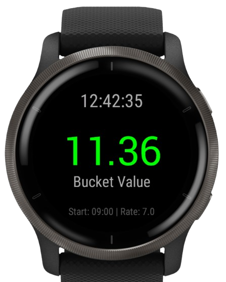

# 🪣 Fruit Picking Rate

   

**A Garmin widget to help you track the minimum bucket rate based on your hourly wage and start time.**

  

    
  

  

    

      This widget helps you stay informed about the <strong>minimum bucket rate</strong> you need to achieve to meet your hourly wage goal.
      Perfect for <em>fruit picking</em> workers, it adjusts based on your start time and target wage.
    

  

---

## 🔧 How to install ?

- Place the .prg file into your **./GARMIN/APPS/** folder

---

## ⌚ Compatible Devices
Currently available for:
- [x] **Garmin Venu 2**

---

## 📜 Changelog

### **v1.0.0** *(24/01/2026)*
- Initial public release for Venu 2 only.

---

## 📬 Contact
For questions, suggestions, or bug reports, feel free to open an issue.

---

*© 2026 - Developed by Paul Salaun*
